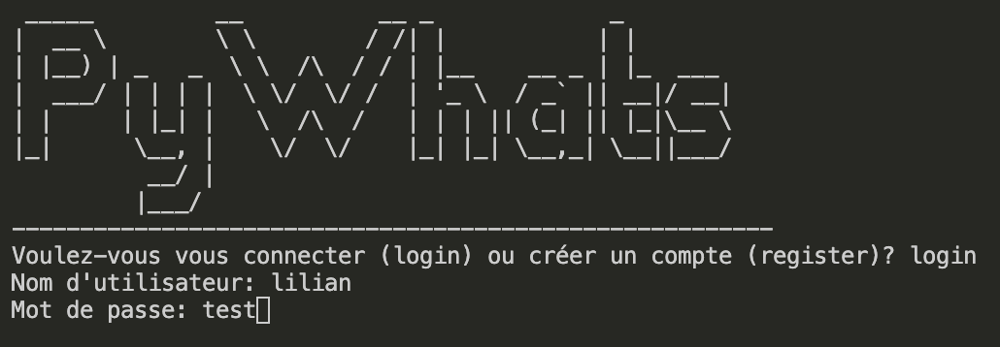
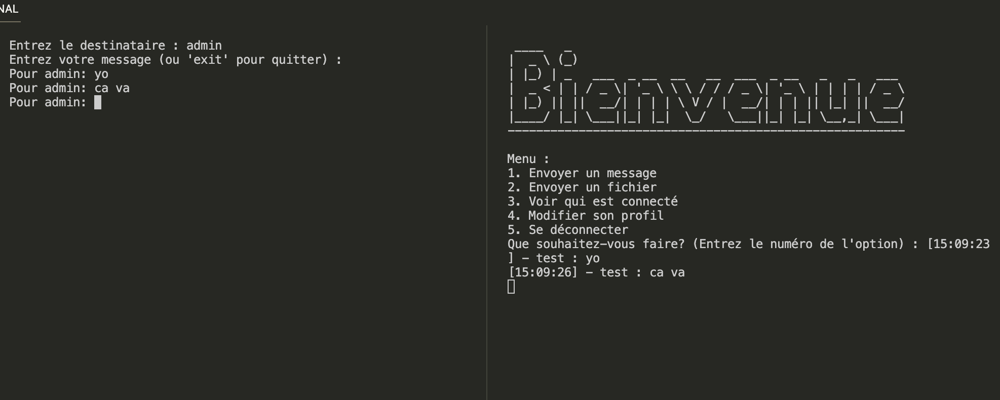

# PyWhats
Le but est de concevoir et implémenter un service de messagerie instantanée en Python qui s’inspire des fonctionnalités de WhatsAPP. L’application développée doit intégrer les fonctionnalités de base d’échange de messages mais aussi d’autres fonctionnalités telles que l’envoi de fichier, la gestion de profil, la sauvegarde des messages...

## Sommaire
- [Features](#features) 
- [Updates](#updates) 

## Features
- Création et connexion compte user

- Envoie de message et de fichier (txt)

- Consultation des personnes connectées

- Modification du nom d'utilisateur et MDP de l'utilisateur

## UPDATES
### Update 24/01/2024 -> V5
- **Ajout** : Vérification lors de l'update du username si le nouveau nom est déjà utilisé ou non
- **Modification** : Correction de l'affichage de l'emetteur du message lors de la modification du username
- **Prochains ajouts** : Historisation des conversation

### Update 23/01/2024 -> V4
- **Ajout** : NULL
- **Modification** : Possibilité d'envoie d'image
- **Prochains ajouts** : Historisation des conversation

### Update 23/01/2024 -> V3
- **Ajout** : NULL
- **Modification** : Correction du bug de déconnexion puis reconnexion
- **Prochains ajouts** : Historisation des conversation

### Update 23/01/2024 -> V2
- **Ajout** : Envoie et récéption de fichier (txt)
- **Modification** : Lorsqu'un client se connecte, on vérifie si le compte n'est pas déjà connecté
- **Prochains ajouts** : Historisation des conversation

### Update 22/01/2024 -> V1
- **Ajout** : Modification prénom + modification mdp
- **Modification** : Correction de bug au niveau du client connecté + optimisation du code avec mise en fonction de certaines actions
- **Prochains ajouts** : Historisation des conversation + transfert de fichier